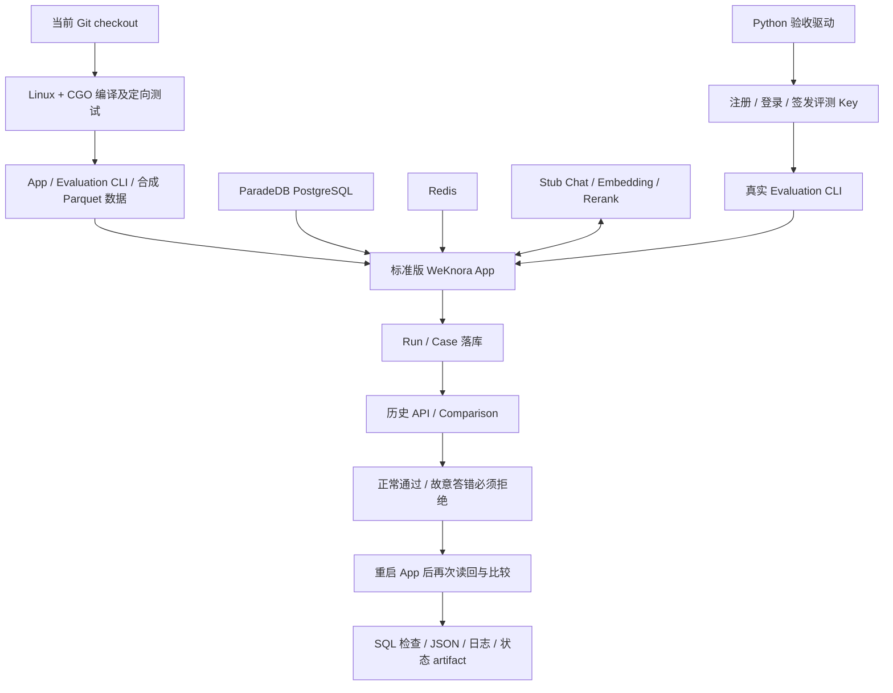

# Evaluation 自包含 CI：设计、使用与验收边界

本阶段对应总设计方案的“第一步：自包含 Evaluation CI”。实现基于
`6c892f58` 后的优化分支，范围是将真实 App 的评测 API、持久化、
comparison 和质量 gate 接入一个可独立启动的自动验收环境。

这里的模型响应是合成测试响应。它验证软件链路的契约，不衡量真实模型质量、
缓存收益、真实费用或生产环境延迟。八解析引擎横评继续暂缓。

## 1. 解决的问题

原 workflow 依赖仓库变量中的外部服务地址、租户、数据集、baseline Run
以及长期 API Key；没有配置时生成 skipped artifact，不能保证 PR 真正经过评测。
此外，外部服务还可能运行另一个 commit，导致评测结果无法归因到当前修改。

新的 workflow 在本次运行中创建数据库、启动从当前 checkout 编译的 App、
注册临时用户、签发评测专用 API Key，完成所有检查后销毁自己的容器和数据卷。
无需预先部署测试服务，也不需要 GitHub Secrets 或真实模型凭据。

## 2. 运行结构



- `docker-compose.evaluation.yml` 是独立配置，不能与生产 Compose 合并。
- `build` 使用 Go 1.26 Debian 镜像，在 Linux + CGO 下执行定向测试和编译。
  checkout 只读挂载，产物写入专用 volume；`GOMAXPROCS=2`、`-p=2`
  控制编译并行度。
- App 执行真实 `cmd/server`，使用标准版容器依赖注入、PostgreSQL migration、
  Redis、租户认证、检索和评测 Service。
- App 的文本段落入库路径不调用解析器，因此不启动 DocReader；DuckDB 的
  Excel/spatial 扩展下载也关闭。该用例不覆盖文件解析。
- 各运行使用唯一 Compose project，没有固定 `container_name`，
  没有主机端口映射。运行服务使用禁止对外访问的内部网络。
- 构建服务可下载 Go 依赖，镜像拉取也需要网络；“自包含”不意味着首次运行完全离线。
- 通过明确的空 `compose.env` 避免加载开发者根目录 `.env`。

## 3. 固定数据和 Stub 的行为

数据由 `ci/evaluation/fixture/main.go` 生成到构建产物目录。
原 `dataset/samples` 和本机 `dataset/cmrc2018` 均不改动。

| 类型 | ID | 内容 |
|---|---|---|
| 问题 | QID 1 | What is the capital of France? |
| 问题 | QID 2 | What is the capital of Japan? |
| 相关段落 | PID 10 | Paris is the capital of France. |
| 相关段落 | PID 20 | Tokyo is the capital of Japan. |
| 干扰段落 | PID 99 | Mars is a planet. |
| 参考答案 | AID 1 / 2 | Paris / Tokyo |

生成与生产 loader 一致的五个文件：`queries.parquet`、`corpus.parquet`、
`qrels.parquet`、`qas.parquet`、`answers.parquet`。App 仍走
`dataset_id=default` 的读取、校验、manifest 和 fingerprint 逻辑。
验收驱动将报告中的逐文件大小、SHA-256、整体 fingerprint 与实际挂载的字节核对。
清单还必须按 loader 顺序包含五个不同的预期文件；重复、缺项、顺序错误或
路径不在清单内都会失败，不能用重复文件凑足五项。

Stub 使用 Python 标准库，无 pip 依赖：

- `/v1/embeddings` 为 France、Japan、干扰文本返回不同的 8 维单位向量。
- `/v1/rerank` 保持输入 index，相关段落得分 0.99，其他段落得分 0.01。
- `/v1/chat/completions` 对固定问题返回 Paris/Tokyo，并支持 SSE 响应格式。
- 仅测试服务内的 `/control` 可以开启错误回答模式，答案变为 Incorrect。
- `/stats` 只统计各操作请求数，不记录请求正文和凭据。

这里的向量、分数和 Token 数量都是测试常量；不应被写入任何真实模型测评报告。
Stub 不提供金额，结果中的 `cost.amount` 必须保持 NULL。Embedding 结果缓存在
本用例中明确关闭，缓存专项检查仍由已有 `embedding-cache.yml` 承担。

## 4. 为什么安排三次 Run

| Run | 模式 | 必须满足的断言 |
|---|---|---|
| baseline | 正常回答 | 两个 Case 成功；真实答案 fingerprint 匹配；相关 PID 正确 |
| candidate | 正常回答 | 与 baseline 配置 hash 相同；comparison 和 gate 通过 |
| degraded | 故意答错 | Pipeline 正常完成；答案质量退化；真实 CLI gate 返回非零 |

baseline 是同一 checkout 内临时生成的对照 Run。它不是官方主线的历史模型测评结果。
两次正常 Run 都必须达到固定用例的质量下限：Recall、MRR、MAP 为 1，
且生成答案 fingerprint 必须匹配参考答案。因此“两次都未检索到结果，
差值却为零”的情况不能通过。

第三次从 HTTP Provider 到 Run/Case 落库再到比较接口完整执行，
用真实的错误答案验证 gate 拒绝；不是手工编辑 comparison JSON 来模拟失败。
gate 比较全部 12 项现有质量指标，容差为 0。

## 5. 提交身份、持久化和错误语义

构建使用 `go build -buildvcs=true`，保留 Go 编译产物中的
`vcs.revision` / `vcs.modified`。验收要求 Run 的
`config.runtime.commit_sha` 等于实际 `git rev-parse HEAD`，
且 `commit_available=true`；不接受 unknown 或缺失版本。
本阶段没有添加可以在运行时覆盖提交身份的环境变量。

本机 checkout 包含未提交/未跟踪文件时，`vcs_modified` 可能为 true；
该事实保留在报告中，不伪装成干净构建。GitHub Actions 另外核对
checkout 的 HEAD 等于 `GITHUB_SHA`。

每次 Run 验证：

1. 任务与结果都成功，total/finished 均为 2；
2. 两个不同 Case ID 均存在，Ground Truth PID 与指标输入 PID 一致；
3. 没有无法映射的 PID，Usage 有真实适配器收到的合成上报数据；
4. Run overview 与分页 Case API 均返回完整的已持久化结果；
5. 模型三个操作都实际到达 Stub。

完成三次 Run 后重启 App，重新登录签发评测 Key，通过历史 API 读回
三份 Run/Case，并逐项比较重启前后的结果。正常 Run 的 comparison/gate 再执行一次。
最后直接查询 PostgreSQL，要求三条成功 Run、六条成功 Case，且所有终态租约释放。
这证明的是完成后的历史数据读取设计；运行中崩溃、租约过期和多实例接管
仍由租约专项测试及后续故障演练覆盖。

未认证请求必须得到 401；实际评测使用只有 `run_evaluations` capability 的
租户级 Key。凭据仅保留在进程内存和 CLI 子进程环境，不落到 artifact。
HTTP/CLI/校验失败均返回非零，不再使用“缺配置就跳过成功”的分支。

## 6. 本地运行

前提：Docker Engine 可用，Docker Compose v2 支持 `up --wait`，
并安装 Git 和 Bash。不需要本机 Go/Python 来运行完整容器验收。
首次运行会下载镜像和 Go 依赖。

在仓库根目录的 Bash / Git Bash 中执行：

```bash
bash scripts/evaluation_ci.sh
```

默认结果目录为 `tmp/evaluation-ci/<UTC 时间>-<进程 ID>/`，保留历史运行。
脚本在成功或失败时均尝试收集证据，然后仅清理本次唯一 project 的资源。
如果 CI 进程被强制终止，EXIT trap 不能保证执行；本地残留资源应按实际 project
名处理。不要对生产 Compose 执行该清理命令。

只检查无需 Docker Engine 的内容：

```bash
python3 -m unittest discover -s ci/evaluation -p 'test_*.py' -v
bash -n scripts/evaluation_ci.sh
bash -n ci/evaluation/build.sh
EVALUATION_EXPECTED_COMMIT="$(git rev-parse HEAD)" \
  docker compose --env-file ci/evaluation/compose.env -f docker-compose.evaluation.yml config --quiet
go test ./cmd/evaluation -count=1
```

## 7. Artifact 内容

| 文件 | 用途 |
|---|---|
| `baseline/candidate/degraded.json` | CLI 保存的完整评测响应 |
| `*-run.json`、`*-cases.json` | 历史 API 与 Case 证据 |
| `comparison.json`、`regression.json` | 正常及退化比较结果 |
| `*-gate.log` | 正常 gate 通过、退化 gate 被拒绝 |
| `restart-*.json` | 重启后的读回与比较证据 |
| `provider-stats.json` | 三类 Stub 请求计数 |
| `source-commit.txt`、`build-info.txt` | checkout 与可执行文件编译信息 |
| `database-check.txt` | PostgreSQL 直接断言结果 |
| `evaluation.sql` | 仅 Run/Case 两张表的 SQL 导出 |
| `services.log`、`compose-ps.txt`、`build.log` | 运行或失败诊断 |
| `run-status.json`、`restart-status.json`、`status.txt` | 各阶段和最终退出状态 |

不导出用户、认证 Token、租户 Key、模型配置表或完整数据库。
若某阶段未执行，其产物缺失不能解读为通过；总状态以脚本退出码和 Actions
job 结果为准。artifact 在 Actions 中保留 14 天。

## 8. 2026-09-13 本阶段实际验证记录

| 检查 | 当前证据 |
|---|---|
| Stub HTTP 协议、报告与数据集校验测试 | 10 个 unittest 测试通过；非法报告覆盖 11 类变体，非法 manifest 覆盖 7 类变体，另验证同大小文件内容被改动时必须失败 |
| CLI 现有回归 | `go test ./cmd/evaluation -count=1` 通过 |
| 合成数据确定性 | 生成两次，五个 Parquet 文件 SHA-256 全部一致 |
| Compose 静态检查 | `config --quiet` 通过 |
| Actions workflow | actionlint 1.7.7 检查通过 |
| 两个 Bash 脚本 | `bash -n` 通过 |
| 原生 Windows Evaluation 包测试 | 被既有 `pg_query.Parse/Deparse` CGO 环境问题阻断 |
| 统一入口完整试跑 | Docker Engine 连接失败；脚本返回 1 并保存失败状态 |
| Linux 编译、App + PG + Redis + Stub 完整 E2E | 当前本机未完成 |
| GitHub Actions 远端运行 | 未执行 |

Docker Desktop 日志显示启动失败发生在 Inference manager：
`dockerInference` 套接字无法访问，随后后端退出。本阶段不重置或迁移
Docker 的已有业务数据。只有修复环境后统一入口完整退出 0，或取得
GitHub Actions 成功 artifact，才可以把该项升级为“完整 E2E 已验收”。

后续顺序保持不变：先补齐本项实际容器/Actions 证据，再进行真实 Provider
费用与调用验收、Embedding cold/warm/disabled 对照、Wiki 小样本和多实例故障演练。
